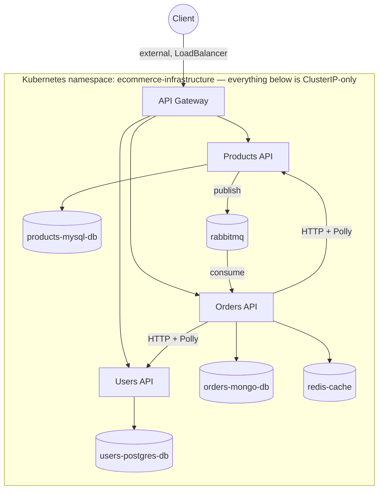

# Infrastructure — `ecommerce-infrastructure`

Infrastructure-as-code for the **eCommerce Microservices** system: Kubernetes manifests, seeded-database image builds, and the CI/CD backbone that ties all four application repos together.

Part of a 5-repository microservices system. Application repos: [`api-gateway`](https://github.com/ym-harsha-ecommerce-microservices/api-gateway) · [`users-api`](https://github.com/ym-harsha-ecommerce-microservices/users-api) · [`products-api`](https://github.com/ym-harsha-ecommerce-microservices/products-api) · [`orders-api`](https://github.com/ym-harsha-ecommerce-microservices/orders-api). See the [organization](https://github.com/ym-harsha-ecommerce-microservices) for everything at once.

   

## System architecture



## Why this repo exists

The course builds everything Azure-native: **Azure Container Registry**, **AKS**, and **Azure DevOps** pipelines. None of that is free, and it locks the deployment story to one cloud. This repo is a from-scratch, open-source-only substitute that achieves the same outcome:

| Course used | This repo uses | Why |
|---|---|---|
| Azure Container Registry | **GitHub Container Registry (GHCR)** | Free, and already co-located with the code and CI |
| AKS (managed cluster) | **Minikube**, self-hosted, local | Zero cloud cost, full control over the cluster |
| Azure DevOps Pipelines + Boards + Repos | **GitHub Actions** + a **GitHub Organization** (branches/PRs/issues) | Free tier is generous, and keeps everything — code, CI, project tracking — on one platform |
| Azure DevOps self-hosted agent | **Self-hosted GitHub Actions runner** | Needed regardless, since no GitHub-hosted runner can reach a Minikube cluster running on a local machine |

The Kubernetes manifests, the network topology (ClusterIP vs. LoadBalancer), and the deployment *shape* all mirror what the course teaches — the substitutions above are purely about which platform hosts each piece, not a different architecture.

## Repository layout

```
ecommerce-infrastructure/
├── .github/workflows/
│   └── infra-ci.yml
├── build/
│   ├── init-prod-db/
│   │   ├── orders-mongo-db/
│   │   │   ├── Dockerfile.orders-mongo
│   │   │   └── init-prod-orders-db.js
│   │   ├── products-mysql-db/
│   │   │   ├── Dockerfile.products-mysql
│   │   │   └── init-prod-products-db.sql
│   │   └── users-postgres-db/
│   │       ├── Dockerfile.users-postgres
│   │       └── init-prod-users-db.sql
│   └── docker-compose.build.yml
└── k8s/
    ├── deployments/
    │   ├── api-gateway-deployment.yml
    │   ├── orders-api-deployment.yml
    │   ├── orders-mongo-db-deployment.yml
    │   ├── products-api-deployment.yml
    │   ├── products-mysql-db-deployment.yml
    │   ├── rabbitmq-deployment.yml
    │   ├── redis-cache-deployment.yml
    │   ├── users-api-deployment.yml
    │   └── users-postgres-db-deployment.yml
    └── services/
    |   ├── api-gateway-service.yml         # LoadBalancer — the one externally-reachable service
    |   ├── orders-api-service.yml          # ClusterIP
    |   ├── orders-mongo-db-service.yml      # ClusterIP
    |   ├── products-api-service.yml         # ClusterIP
    |   ├── products-mysql-db-service.yml    # ClusterIP
    |   ├── rabbitmq-service.yml              # ClusterIP
    |   ├── redis-cache-service.yml           # ClusterIP
    |   ├── users-api-service.yml              # ClusterIP
    |   ├── users-postgres-db-service.yml       # ClusterIP
    └── ecommerce-secrets.yml                # Kubernetes Secret — connection strings & credentials
```

**Two purposes, two top-level folders, kept deliberately separate:**
- **`build/`** — only concerned with producing *pre-seeded database images*. Each database gets its own `Dockerfile.<name>` that layers an `init-prod-*` script (SQL for MySQL/Postgres, a `.js` init script for Mongo) on top of the base image, so the container has its schema and initial data baked in the moment it starts — no manual seeding step after deploy. `docker-compose.build.yml` builds all three and pushes them to GHCR.
- **`k8s/`** — pure deployment/service manifests. Nothing here builds anything; it only describes how the already-published images (application services *and* the seeded DB images from `build/`) should run in the cluster.

## Network design

Every internal service — the three APIs, all three databases, RabbitMQ, Redis — is a **`ClusterIP`** Service: reachable from inside the cluster, invisible from outside it. The **API Gateway is the only `LoadBalancer`**, making it the single point of entry for anything outside the cluster. This is enforced at the manifest level, not just by convention — there's no way to reach `users-postgres-db` or `orders-api` directly without going through the gateway first.

## Published images (GitHub Container Registry)

| Package | Contents |
|---|---|
| `ecommerce-api-gateway` | API Gateway application image |
| `ecommerce-users-api` | Users microservice application image |
| `ecommerce-products-api` | Products microservice application image |
| `ecommerce-orders-api` | Orders microservice application image |
| `ecommerce-users-db` | Pre-seeded PostgreSQL image for Users |
| `ecommerce-products-db` | Pre-seeded MySQL image for Products |
| `ecommerce-orders-db` | Pre-seeded MongoDB image for Orders |

Each application image is versioned both as `:latest` and as `:v1.<CI run number>`, so any deployment can be pinned to an exact build rather than always tracking the newest one.

## Deploying to a local cluster

```bash
# 1. Start the local cluster
minikube start

# 2. Apply everything (namespace, then deployments + services)
kubectl apply -f k8s/deployments/
kubectl apply -f k8s/services/

# 3. Confirm everything is up
kubectl get pods -n ecommerce-infrastructure
kubectl get svc -n ecommerce-infrastructure
```

`ecommerce-secrets.yml` needs your own values (DB credentials, connection strings) populated before applying — it's not committed with real secrets.

To rebuild the seeded database images yourself instead of using the published ones:

```bash
cd build
docker compose -f docker-compose.build.yml build
```

## CI/CD — the full picture

Every application repo (`api-gateway`, `users-api`, `products-api`, `orders-api`) follows the same two-workflow pattern:

**CI** (`*-ci.yml`, runs on GitHub-hosted `ubuntu-latest`, triggered on push/PR to `main`):
```
checkout → setup .NET → restore → build → test → build & push Docker image to GHCR
```

**CD** (`*-cd.yml`, triggered by the matching CI workflow completing successfully via `workflow_run`, runs on the **self-hosted runner**):
```yaml
kubectl set image deployment/<service>-deployment <service>=ghcr.io/<owner>/ecommerce-<service>:latest -n ecommerce-infrastructure
kubectl rollout restart deployment/<service>-deployment -n ecommerce-infrastructure
```

The CD step *has* to run on a self-hosted runner — a GitHub-hosted one has no network path to a Minikube cluster sitting on a local machine. The runner (`ecommerce-global-runner` — Windows, x64) is registered once at the **organization level** and shared across all four repos, rather than duplicated per-repo; it only needs to be online at deploy time, which is why it shows as "Offline" in GitHub's UI the rest of the time.

## Organization structure

All 5 repositories live under one GitHub Organization rather than as scattered personal repos — a deliberate stand-in for what Azure DevOps would call Boards + Repos: branches and pull requests carry the same role Azure Boards' work-item-linked PRs would, just on GitHub's free tier instead of a paid Azure DevOps org.

## Origin & Certification

Built while working through Harsha Vardhan's [.NET Microservices with Azure DevOps & AKS](https://www.udemy.com/course/dot-net-microservices-ecommerce-project-azure-devops-kubernetes-aks/) course. This repo specifically replaces the course's Azure DevOps + AKS + Azure Container Registry section with an equivalent, fully open-source pipeline — everything above (GHCR, Minikube, GitHub Actions, a self-hosted runner) was independently researched and set up to reach the same result without an Azure subscription.

🎓 **Certificate:** [Certificate link]([ADD_CERTIFICATE_LINK_HERE](https://drive.google.com/file/d/1VVxsmjJU57NlZn8QpqDcRlLGiE5nztiJ/view?usp=drive_link))
